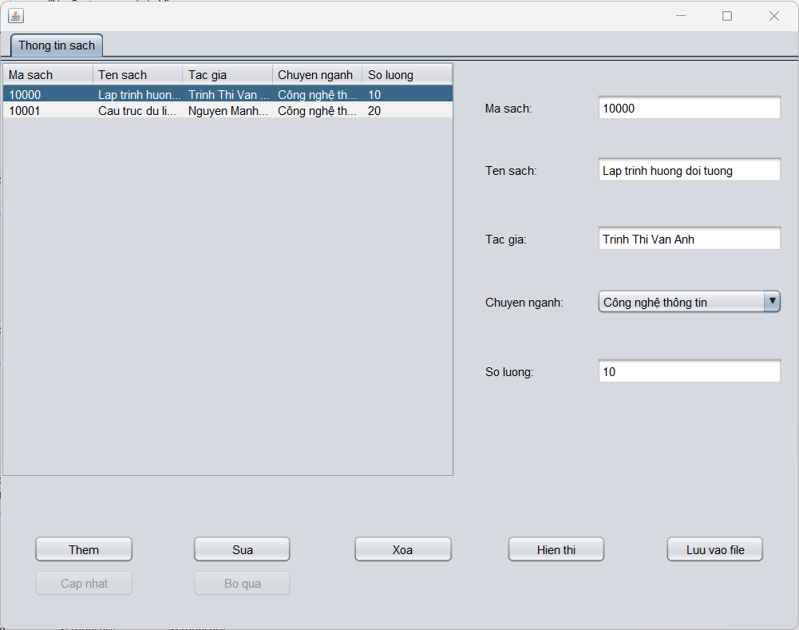

## About
CRUD desktop application with Java AWT & Swing

## Built With
* [![Java][Java-shield]][Java-url]
* [![Apache Maven][Apache Maven-shield]][Apache Maven-url]
* AWT
* Swing

## Features

    

<!-- MARKDOWN LINKS & IMAGES -->
<!-- Tech stack -->
[Java-shield]: https://img.shields.io/badge/Java-ED8B00?style=for-the-badge&logo=java&logoColor=white
[Java-url]: https://www.java.com/
[Apache Maven-shield]: https://img.shields.io/badge/Apache%20Maven-C71A36?style=for-the-badge&logo=Apache%20Maven&logoColor=white
[Apache Maven-url]: https://maven.apache.org/